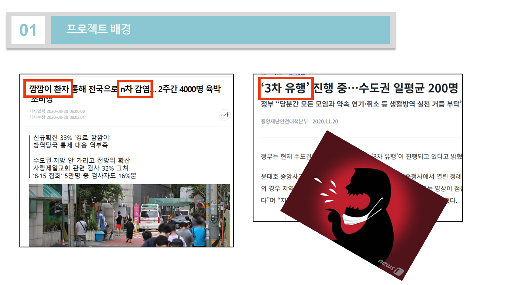

# :mask: Facial mask-Area-Detection 을 활용한 올바른 마스크 착용 여부 판단 모델링 :lock: ​   

\+ 멀티캠퍼스 딥러닝 기반 AI 엔지니어링 세미 2차 프로젝트 (CNN)

​	

- __참여__ : [__ineed-coffee__](https://github.com/ineed-coffee) ,  [__cjlee0217__](https://github.com/cjlee0217) , [__okyou1000__](https://github.com/okyou1000) , [__Parkjiwonha__](https://github.com/Parkjiwonha) , [__ikeven94__](https://github.com/ikeven94) 
- __기간__ : 2020.11.12~2020.11.23
- __주제__ : Facial mask-Area-Detection 을 활용한 올바른 마스크 착용 여부 판단
- __결과보고서(전체 내용)__ :   [Here](https://drive.google.com/file/d/1-IWaciQrFbH6eN0UEdoTkQCWkAuaM9o2/view?usp=sharing)  

***
# 결과보고서 요약

 
 
***
# 분석 개요 및 목표

- 코로나19 2차 대유행 이후 __`깜깜이 환자`__ , __`n차 감염`__ 의 키워드가 문제로 떠올랐다. 특정 지역을 중심으로 발생했던 지난 1,2차 대유행의 성격과 다르게 전국적으로 불규칙적인 확진자 증가 추세를 보이며 3차 대유행이 시작되었고, 이러한 대유행의 큰 원인으로 일명 __`코스크`__ , __`턱스크`__ 와 같은 부적절한 마스크 착용이 언급되었다.
- 정부에서는 이러한 잘못된 착용 습관을 통제하고 올바른 착용을 유도하는 행정명령을 발령하였고 본 프로젝트 또한 이와 같은 마스크 착용법에 따른 __`불량/적절`__ 판별 모델을 생성하여 올바른 마스크 착용 문화를 유도하는 것을 목표로 함.
- 데이터셋은 open face dataset 을 통하여 마스크 합성 이미지를 생성하였고 , 착용 방법에 따라 크게 4가지 분류로 구분하여 판별 모델을 학습 및 생성함. 
- 모델은 총 6가지 CNN 모델을 학습하여 성능을 비교하였음.

 
 

***
# 참여인원 역할
작성자(__이동재__) 주요 담당 부분

1. facial-mask area 추출 전처리 로직 작성
2. thesis reference model 학습 및 평가
3. Inception v3 학습 및 평가
4. 시뮬레이션 executable code 작성 및 영상 제작

 
***
# 데이터 생성 및 전처리 과정
### `데이터 생성` 
- 사진에서 특정부분(예상 마스크 착용 부위)을 추출하여 입력으로 사용해야 하기 때문에 rotation , warp , flip , translate 과 같은 기법으로 이미지 증식의 효과를 기대하기 힘들다고 판단하여 기존 사람 얼굴 이미지에 분류에 맞는 마스크 합성 이미지를 생성하여 활용하기로 결정
- 사람 얼굴의 이미지는 Kaggle 의 [FFHQ Face Data Set](https://www.kaggle.com/greatgamedota/ffhq-face-data-set) 을 활용
- 이미지 합성은 파이썬의 [Face Recognition](https://pypi.org/project/face-recognition/) 패키지와 두 가지 마스크 사진을 통해 진행
- 분류는 총 4가지로 합성을 진행하였으며 다음과 같음.

| No mask | Chin mask | Nose mask |  Full mask  |
| :-----: | :-------: | :-------: | :---------: |
| 미착용  |  턱스크   |  코스크   | 올바른 착용 |

 
 
> 합성에 쓰인 두 마스크 이미지

 

***
### `데이터 전처리` 
- 합성 이미지에서 마스크 착용 예상 영역에 해당하는 부분만 추출하는 전처리를 진행 (__`openCV`__) 

- 해당 전처리를 위해 관련 논문 [출입 통제에 활용 가능한 딥러닝 기반 마스크 착용 판별](https://www.dbpia.co.kr/Journal/articleDetail?nodeId=NODE09807081) 을 참고하여 전처리를 진행

  - eye-detection 수행 후 두 눈이 수평선에 위치하도록 rotating
  - 눈 사이의 거리(L) 를 기반으로 좌우/상하 각각 2.2L , 2.4L 영역에 대하여 resizing & crop

> #### eye detection

 

> #### rotate image

 

> #### extract ROI 

 
> #### Resize & Crop

 
> #### Result

 

***
# 모델 학습 및 평가 (일부 예시)

- 총 6가지의 CNN 모델을 통해 판별 모델을 생성 및 성능 비교를 진행

 

### `Basic CNN (thesis reference)` 
 
 

***
### `Inception v3` 
 
 

***
### `VGGNET (vgg16)` 
 
 
 

***
# 최종 모델 선정 및 시연 영상
### `최종 모델 선정`  

 

### `시연 영상` 

### [시연 영상(simulation video)](https://drive.google.com/file/d/1IlzvgOAeK7getFS02K_aWnXlLniFIVer/view?usp=sharing)  
***

